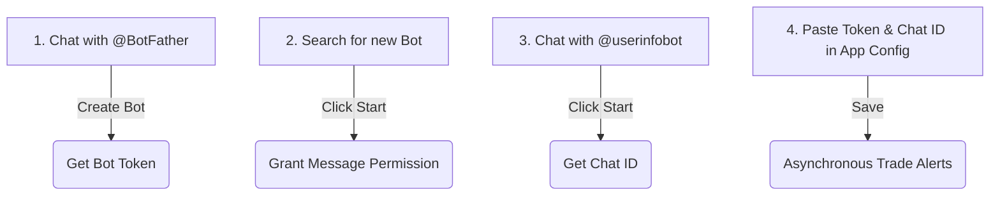

# Cloud Trader Pro - Installation & Deployment Guide

Welcome to the **Cloud Trader Pro** installation guide. This document provides step-by-step instructions to set up, configure, and run the backend server on a **Windows PC** or an **Ubuntu Linux Server**. 

---

## 🏗️ System Architecture Overview
Cloud Trader Pro is built on a **Headless Decoupled Architecture**:
*   **Headless Backend (Server):** Runs 24/7 autonomously on a server or local PC, processing live market ticks and executing algorithms.
*   **Web Dashboard:** Accessible via browser for remote monitoring.
*   **Tkinter Desktop UI:** Runs locally on your PC for professional scalping and deep configuration.

---

## ⚡ Option 1: Docker Deployment (Recommended)
Docker is the easiest and most secure way to run the Cloud Trader Pro backend. It packages the application, dependencies, and runtime together so you do not need to install Python or manage packages manually.

### Step 1: Install Docker

#### **For Ubuntu Linux Server:**
Run the following commands in your terminal to install Docker and Docker Compose:
```bash
# Update package database and upgrade existing software
sudo apt update && sudo apt upgrade -y
sudo apt install -y curl bzip2 tar git

# Install Docker Engine and Compose plugin
sudo apt install -y docker.io docker-compose-v2

# Start and enable Docker service on boot
sudo systemctl enable --now docker
```

#### **For Windows PC:**
1. Download and install [Docker Desktop for Windows](https://www.docker.com/products/docker-desktop/).
2. During the installation process, ensure the **WSL 2 backend** option is checked (enabled by default).
3. Restart your computer when prompted.

---

### Step 2: Download Deployment Files from GitHub

Instead of manually copying orchestration assets, you can download all required files (such as `docker-compose.yml`, configuration templates, and setup helper scripts) directly from our public GitHub build repository.

Choose **Method A (Automated)** or **Method B (Manual)**:

#### **Method A: Automated One-Line Installer (Recommended)**
Run this command in your terminal to automatically create folders, download files, and configure permissions:
*   **Ubuntu / Linux:**
    ```bash
    curl -sSL https://raw.githubusercontent.com/bibhutibbb/cloud-trader-pro-build/main/install.sh | sudo bash
    ```
*   **Windows (PowerShell run as Administrator):**
    ```powershell
    Set-ExecutionPolicy Bypass -Scope Process -Force; [System.Net.ServicePointManager]::SecurityProtocol = [System.Net.SecurityProtocolType]::Tls12; iex ((New-Object System.Net.WebClient).DownloadString('https://raw.githubusercontent.com/bibhutibbb/cloud-trader-pro-build/main/install.ps1'))
    ```

---

#### **Method B: Manual Download**
If you prefer to download files manually, run these commands to set up the directories and download individual files:
*   **Ubuntu / Linux:**
    ```bash
    sudo mkdir -p /opt/cloudtraderpro/configs
    cd /opt/cloudtraderpro

    sudo curl -sSL https://raw.githubusercontent.com/bibhutibbb/cloud-trader-pro-build/main/docker-compose.yml -o docker-compose.yml
    sudo curl -sSL https://raw.githubusercontent.com/bibhutibbb/cloud-trader-pro-build/main/setup.sh -o setup.sh && sudo chmod +x setup.sh
    sudo curl -sSL https://raw.githubusercontent.com/bibhutibbb/cloud-trader-pro-build/main/cloudflare_tunnel_command.txt -o cloudflare_tunnel_command.txt
    sudo curl -sSL https://raw.githubusercontent.com/bibhutibbb/cloud-trader-pro-build/main/configs/app_settings.json.sample -o configs/app_settings.json.sample
    ```
*   **Windows (PowerShell):**
    ```powershell
    New-Item -ItemType Directory -Force -Path "C:\CloudTraderPro\configs"
    Set-Location "C:\CloudTraderPro"

    Invoke-WebRequest -Uri "https://raw.githubusercontent.com/bibhutibbb/cloud-trader-pro-build/main/docker-compose.yml" -OutFile "docker-compose.yml"
    Invoke-WebRequest -Uri "https://raw.githubusercontent.com/bibhutibbb/cloud-trader-pro-build/main/setup.ps1" -OutFile "setup.ps1"
    Invoke-WebRequest -Uri "https://raw.githubusercontent.com/bibhutibbb/cloud-trader-pro-build/main/setup.bat" -OutFile "setup.bat"
    Invoke-WebRequest -Uri "https://raw.githubusercontent.com/bibhutibbb/cloud-trader-pro-build/main/cloudflare_tunnel_command.txt" -OutFile "cloudflare_tunnel_command.txt"
    Invoke-WebRequest -Uri "https://raw.githubusercontent.com/bibhutibbb/cloud-trader-pro-build/main/configs/app_settings.json.sample" -OutFile "configs\app_settings.json.sample"
    ```

---


### Step 3: Configure settings & License Activation
Before running the container, configure the application settings and activate your license.

1. Navigate to the `configs/` folder.
2. Rename `app_settings.json.sample` to `app_settings.json` (or edit the existing one).
   *   **Ubuntu / Linux:**
       ```bash
       cd /opt/cloudtraderpro
       sudo cp configs/app_settings.json.sample configs/app_settings.json
       sudo nano configs/app_settings.json
       ```
3. Open `app_settings.json` in a text editor and fill in your details:

```json
{
    "dashboard_password": "your_secure_web_password",
    "local_api_key": "shared_secret_for_tkinter_app",
    "active_broker": "flattrade", 
    "jwt_secret": "long_random_string_for_web_tokens",
    "session_timeout_minutes": 1440,
    "server_port": 8002,
    "license_key": "your_license_key"
}
```

#### ⚙️ Configuration Parameters Explained:
*   **`dashboard_password`**: The password used to log in to the web browser dashboard interface. Choose a strong, unique password.
*   **`local_api_key`**: A shared secret key used to authenticate and connect the local Tkinter desktop application securely with the remote server. Both the server's `app_settings.json` and the client's `cf_secrets.json` must share this exact key.
*   **`active_broker`**: Specifies the broker to be used by the trading system. Supported values are `"flattrade"` or `"upstox"`.
*   **`jwt_secret`**: A long random secret key used by the backend to sign web tokens (JSON Web Tokens) for the dashboard session. Change this to a secure random string (e.g. 32 characters) to secure your browser session tokens.
*   **`session_timeout_minutes`**: The duration (in minutes) for which your login session remains active in the browser dashboard before requiring re-authentication. The default is set to `1440` minutes (exactly 24 hours / 1 day).
*   **`server_port`**: The port number on which the FastAPI backend web server runs and listens for incoming requests. The default is `8002`.
*   **`license_key`**: The cryptographically signed license key generated for your account. This is required to unlock the trading engine and activate automated strategies.

> [!IMPORTANT]
> Change the default passwords/secrets to highly secure, random strings to prevent unauthorized access. The `license_key` is required to authenticate and unlock core trading routines.

---

### Step 4: Starting the Application (Docker Hub)

By default, the provided `docker-compose.yml` file is preconfigured to automatically pull the official production image directly from **Docker Hub** (`bibhutibbb/cloudtraderpro:latest`).

Simply navigate to your deployment folder and run:
*   **Ubuntu / Linux:**
    ```bash
    sudo docker compose up -d
    ```
*   **Windows (PowerShell):**
    ```powershell
    docker compose up -d
    ```

Docker will automatically pull the latest image layers from Docker Hub, configure the networks, and start the trading backend.

---

### Alternative: Offline Deployment (From Distributed `.tar` File)
If your developer provided you with a packaged offline container image file (e.g. `cloudtraderpro_v1.tar`):

1. **Load the image file into Docker:**
   *   **Ubuntu / Linux:**
       ```bash
       sudo docker load -i cloudtraderpro_v1.tar
       ```
   *   **Windows (PowerShell):**
       ```powershell
       docker load -i cloudtraderpro_v1.tar
       ```
2. **Start the server:**
   *   **Ubuntu / Linux:**
       ```bash
       sudo docker compose up -d
       ```
   *   **Windows (PowerShell):**
       ```powershell
       docker compose up -d
       ```

---

### Step 5: Stopping & Removing Containers
If you need to stop the server or clean up the container resources:

*   **Stop the running containers (keeping configuration and database data intact):**
    *   **Ubuntu / Linux:**
        ```bash
        sudo docker compose stop
        ```
    *   **Windows (PowerShell):**
        ```powershell
        docker compose stop
        ```
*   **Stop and completely remove the containers (freeing up ports/resources):**
    *   **Ubuntu / Linux:**
        ```bash
        sudo docker compose down
        ```
    *   **Windows (PowerShell):**
        ```powershell
        docker compose down
        ```
*   **Remove the containers and delete the loaded image (to free up disk space):**
    *   **Ubuntu / Linux:**
        ```bash
        sudo docker compose down
        sudo docker rmi bibhutibbb/cloudtraderpro:latest
        ```
    *   **Windows (PowerShell):**
        ```powershell
        docker compose down
        docker rmi bibhutibbb/cloudtraderpro:latest
        ```

---

### Step 5: Updating the Docker Container (When a New Version is Released)

When a new version of the Cloud Trader Pro image is uploaded to Docker Hub, you can update your setup easily without losing your configurations, databases, or logs (since they are stored outside the container in your host directories).

#### **The Correct Update Command Sequence:**
Navigate to your deployment directory (e.g., `/opt/cloudtraderpro` on Linux or `C:\CloudTraderPro` on Windows) and run:

*   **Linux / Ubuntu:**
    ```bash
    cd /opt/cloudtraderpro
    sudo docker compose pull
    sudo docker compose up -d
    ```
*   **Windows (PowerShell):**
    ```powershell
    cd C:\CloudTraderPro
    docker compose pull
    docker compose up -d
    ```

> [!TIP]
> **Chaining commands on Linux:** If you wish to chain the down and up commands in a single line on Linux, remember that the `sudo` privilege does not carry over across the `&&` operator automatically. You must prepend `sudo` to **both** commands:
> ```bash
> sudo docker compose down && sudo docker compose up -d
> ```
> Omitting `sudo` on the second command will result in a `Permission Denied` socket error.


#### **How it works:**
*   `docker compose pull` downloads the latest image layers from Docker Hub in the background while the application is still running.
*   `docker compose up -d` checks the changes, stops the container, recreates it using the new image, and starts it up—all in less than 2 seconds. You do **not** need to manually run `docker compose stop` or `docker compose down` before pulling.

#### **Will Custom Settings (like Custom Ports or API Keys) Be Overwritten?**
*   **Your API Keys and Credentials:** Completely safe. Your local `configs/app_settings.json` is never modified or overwritten by image updates.
*   **Custom Host Ports (e.g., `8003:8002` in `docker-compose.yml`):** Completely safe *as long as you update using the command sequence above*. Because the image update only downloads the container's interior, your local `docker-compose.yml` file is not replaced.
*   **Caution:** If you update by downloading and re-running the full installer script (`install.sh` / `install.ps1`), it will fetch a clean `docker-compose.yml` from GitHub and overwrite your local file, resetting your mapped host ports back to the default `8002`. If you do this, you will need to re-apply your port edits (e.g. `8003:8002`) inside the `docker-compose.yml` file.

---

## 🐍 Option 2: Local Python Development Deployment (Alternative)

If you prefer running Cloud Trader Pro directly in Python without Docker, follow these instructions.

> [!IMPORTANT]
> **Source Code Distribution Notice:** 
> The core source code files are proprietary and are not hosted on the public GitHub build repository. To deploy locally, you must first obtain the official application distribution package (ZIP file) by contacting the developer directly.

### Step 1: Obtain & Extract the Application Package
1. Contact the developer to request the official Cloud Trader Pro distribution ZIP file.
2. Once received, extract the ZIP archive into your desired deployment folder (e.g. `C:\CloudTraderPro` or `/opt/cloudtraderpro`).
3. Open your terminal or PowerShell inside the extracted directory to run the following setup commands.

### Step 2: Install Prerequisites
*   Python 3.12 installed on your system.
*   The **`uv`** package manager (highly recommended for faster dependency resolution).

### Step 3: Install `uv` Package Manager
*   **Linux / macOS:**
    ```bash
    curl -LsSf https://astral.sh/uv/install.sh | sh
    source $HOME/.local/bin/env
    ```
*   **Windows (PowerShell):**
    ```powershell
    powershell -c "irm https://astral.sh/uv/install.ps1 | iex"
    ```

### Step 4: Install Tkinter & System Packages
*   **Ubuntu Linux:**
    ```bash
    sudo apt update
    sudo apt install -y python3-tk
    ```

### Step 5: Synchronize Dependencies & Run
Navigate to the root project directory and run:
```bash
# Sync virtual environment automatically using uv (skipping development tools)
uv sync --no-dev

# Run the backend server
uv run python run_server.py
```

---

## 📊 Pre-loading Historical Backtesting Data (Parquet Files)
If you have purchased or generated historical backtesting data (saved as `.parquet` files), you can easily pre-load them into the system. This allows immediate backtesting without having to fetch the files over the live broker API.

### **Where to Place the Files:**
*   **Ubuntu Linux (Docker Server):** `/opt/cloudtraderpro/datafetcher/historicaldatas/`
*   **Windows PC (Local Setup):** `C:\CloudTraderPro\datafetcher\historicaldatas\`

---

### **How to Upload the Files to a Linux VPS:**

#### **Method A: SFTP (FileZilla / WinSCP) — Recommended (Graphical)**
1.  Download and install a free SFTP client (like **FileZilla** or **WinSCP**).
2.  Connect to your server using your SSH credentials (IP, username `ubuntu`, and private key file).
3.  On the remote server, navigate to: `/opt/cloudtraderpro/datafetcher/historicaldatas/`.
4.  Drag and drop your Parquet files from your local computer into that folder.

#### **Method B: Command Line (SCP)**
From your local machine's terminal, copy the files directly using:
```bash
scp -i /path/to/key.pem -r /local/path/to/data/*.parquet ubuntu@YOUR_VPS_IP:/opt/cloudtraderpro/datafetcher/historicaldatas/
```

---

### **⚠️ Critical Guidelines:**
1.  **Do Not Rename Files:** The backtest engine expects files to be named exactly according to their symbol/token names (e.g. `NSE_26000.parquet`). Changing the names will make them invisible to the backtester.
2.  **No Server Restart Required:** Because directories are volume-bound, files are detected instantly the moment they are placed in the folder.

---

## 🔔 Configuring Notification Webhooks (Telegram & Discord)

Cloud Trader Pro features an asynchronous notification dispatcher. When a trade is executed, positions are closed, or cooling-down safeguards are triggered, the system instantly delivers rich notifications to your personal devices without adding latency to low-latency trading loops.

### 1. Telegram Bot Alerts

Telegram notifications do not require you to provide your phone number. Instead, they use a **Bot Token** (the sender identity) and your personal **Chat ID** (the destination address).



#### Step-by-Step Telegram Setup:
1. **Create the Telegram Bot (The Sender):**
   * Search for `@BotFather` in the Telegram search bar (it is the official system bot to create other bots) and press **Start**.
   * Send the command `/newbot`.
   * Follow the prompt to give your bot a name (e.g. `My Cloud Trader Alerts`) and a unique username ending in "bot" (e.g. `MyCloudTraderAlertBot`).
   * `@BotFather` will reply with a long **HTTP API Token** (e.g., `123456789:ABCdefGhIJKlmNoPQRsTUVwxyZ`). Copy this token.
2. **Start the Bot (Crucial Anti-Spam Step):**
   * Click on the link provided by BotFather (e.g., `t.me/MyCloudTraderAlertBot`) or search for your bot's username in Telegram.
   * Click the **Start** button (or send a message). 
   * > [!IMPORTANT]
   * > If you do not click **Start**, Telegram's anti-spam security will prevent the bot from sending any messages to your account.
3. **Get Your Chat ID (The Destination Address):**
   * Search for `@userinfobot` in Telegram and press **Start**.
   * The bot will instantly reply with your account's unique `Id` (a series of numbers, e.g. `987654321`). Copy this number.
   * *(Alternative: If you want alerts sent to a Telegram Group instead of a private message, add your custom bot as a member of the group, add `@raw_data_bot` to get the group's Chat ID—which starts with a minus sign like `-100123456789`—and use that ID).*
4. **Save in Cloud Trader Pro:**
   * Go to the **Application Configuration** dashboard in your browser.
   * Toggle on the **Telegram Bot Notifications** switch.
   * Paste the **Telegram Bot Token** and **Telegram Chat ID** in the corresponding fields.
   * Click **Save Settings**.

---

### 2. Discord Webhook Alerts

Discord uses incoming webhooks to push rich embedded messages directly into a specific server channel.

#### Step-by-Step Discord Setup:
1. **Create an Incoming Webhook:**
   * Open your Discord application and navigate to your server.
   * Right-click the channel where you want trading alerts to appear and select **Edit Channel**.
   * Go to **Integrations** -> **Webhooks** -> Click **Create Webhook** or **New Webhook**.
   * Name the webhook (e.g., `Cloud Trader Pro Alerts`) and copy the **Webhook URL**.
2. **Save in Cloud Trader Pro:**
   * Open the **Application Configuration** dashboard.
   * Toggle on the **Discord Webhook Notifications** switch.
   * Paste the copied **Webhook URL** in the field.
   * Click **Save Settings**.

---

## 🔧 Troubleshooting & Special Configurations

### ⚠️ Issue 1: "Illegal Instruction" or NumPy/Pandas crashes on older CPUs
If your server or local PC runs on an older CPU model (which lacks newer AVX/AVX2 instruction sets), the latest versions of NumPy and Pandas may fail and throw errors. 

**Solution for Local Python Setup:**
Downgrade NumPy and Pandas to compatible versions by running:
```bash
uv add "numpy<2.0" "pandas<2.3"
```

**Solution for Docker Setup:**
End users cannot rebuild the Docker image themselves. If you run the Docker setup on an older CPU and encounter this compatibility crash, you must switch to the **Local Python Development Deployment (Option 2)** instead and run the downgrade command (`uv add "numpy<2.0" "pandas<2.3"`) in that environment.

---

### ⚠️ Issue 2: SSL Validation / Connection Errors on Windows
If Windows fails to connect or throws SSL verification errors during broker handshake calls:

**Solution:**
Open PowerShell with **Administrative Privileges** and execute the following commands to update the root certificates store:
```powershell
certutil -generateSSTFromWU roots.sst
certutil -addstore -f root roots.sst
del roots.sst
```

---

### ⚠️ Issue 3: Accessing Container Logs & Managing the Service
Use these common commands to inspect and manage your running services:

*   **View Live Logs:**
    ```bash
    docker compose logs -f
    ```
*   **Stop the Server:**
    ```bash
    docker compose down
    ```
*   **Enter the Container CLI (Inspection):**
    ```bash
    docker exec -it cloud-trader-pro bash
    ```

---

## 🌐 Networking & Cloudflare Tunnel Configuration
The application requires a secure HTTPS connection for both UI access and Broker Authentication callbacks. A **Cloudflare Tunnel** is the safest way to expose the application to the internet without opening firewall ports.

### Step 1: Create a Tunnel in Cloudflare Zero Trust
1. Log into your [Cloudflare Zero Trust Dashboard](https://one.dash.cloudflare.com/).
2. Navigate to **Access** -> **Tunnels** -> Click **Create a Tunnel**.
3. Select **Cloudflare** as your connector type, name the tunnel, and save it.
4. Under "Install and run a connector", choose **Docker** and copy the command provided (or copy just the raw `--token` value).

---

### Step 2: Configure the Tunnel Sidecar (Automatic Setup)
To configure the tunnel companion container automatically:

1. Open `cloudflare_tunnel_command.txt` in a text editor. On Ubuntu Linux, you can open and edit it using `nano`:
   ```bash
   cd /opt/cloudtraderpro
   sudo nano cloudflare_tunnel_command.txt
   ```
2. Paste the **entire** `docker run` command copied from Cloudflare (or paste the raw token string).
3. Run the automated script:
    *   **Ubuntu / Linux:**
        ```bash
        chmod +x setup.sh
        sudo ./setup.sh
        ```
    *   **Windows (PowerShell):**
        Double-click `setup.bat` (or execute `.\setup.ps1` in an elevated shell).

The setup script will automatically extract the token, update your `.env` configuration, create a `docker-compose.override.yml` sidecar container, and boot up both the trader backend and the tunnel!

---

### Step 3: Route Your Domain
1. In the Cloudflare Tunnel dashboard, go to the **Public Hostname** tab.
2. Click **Add a public hostname**.
3. Configure the fields:
    *   **Subdomain:** `trader` (or any subdomain of your choice, e.g. `trader.yourdomain.com`).
    *   **Domain:** Select your registered domain.
    *   **Type:** `HTTP`
    *   **URL:** `cloud-trader-pro:8002` (routing requests internally inside the Docker network).
4. Save the Hostname configuration.

---

### Step 4: Broker-Side Handshake
1. Log into the Developer Portal for your Active Broker (**Flattrade** or **Upstox**).
2. Select your App and locate the **Redirect URL** field.
3. Update the redirect URL according to your setup:
   * **For Remote Server / Cloudflare Tunnel:** `https://trader.yourdomain.com/api/auth/callback`
   * **For Local Windows PC Setup (No Domain):** `http://localhost:8002/api/auth/callback` *(Note: If you changed the default server port, replace `8002` with your custom port).*
4. > [!IMPORTANT]
   > **Critical:** Ensure there are no trailing slashes or spaces. The URL must match the broker registration exactly.

---

### Step 5: Starting & Connecting the Local Desktop Client (Tkinter App)
The Tkinter desktop application (`main.py`) is designed to run on a **local machine (Windows PC or local Linux Desktop)**. It cannot display a graphical interface if run directly on a headless Ubuntu Linux Server without a desktop environment; however, it can connect remotely to a backend hosted on an Ubuntu Server.

> [!NOTE]
> A standalone `.exe` package for Windows is planned for a future release. Currently, the Tkinter app is run using Python. To connect the desktop client remotely (either via Python or the future `.exe` package), you must configure connection secrets.

#### **Starting the Tkinter App:**
Navigate to the project root directory on your local machine and run:
```bash
uv run python main.py
```

#### **Configuring Connection Secrets (`configs/cf_secrets.json`):**
Create or edit `configs/cf_secrets.json` in your local installation's `configs` folder to set the backend URL and Cloudflare Access tokens:

```json
{
    "base_url": "https://trader.yourdomain.com",
    "ws_url": "wss://trader.yourdomain.com/ws",
    "use_cloudflare": true,
    "local_api_key": "must_match_app_settings_on_server",
    "CF-Access-Client-Id": "your-cloudflare-client-id.access",
    "CF-Access-Client-Secret": "your-cloudflare-client-secret-hex-string"
}
```

*   **`base_url` / `ws_url`**: Point these to your server URL:
    *   **Local Python setup / SSH Port Forwarding:** Use `"base_url": "http://localhost:8002"` and `"ws_url": "ws://localhost:8002/ws"` (with `"use_cloudflare": false`).
    *   **Cloudflare Tunnel Remote setup:** Use `"base_url": "https://trader.yourdomain.com"` and `"ws_url": "wss://trader.yourdomain.com/ws"` (with `"use_cloudflare": true`).
*   **`local_api_key`**: This **must** match the `local_api_key` configured in the server's `app_settings.json`.
*   **`CF-Access-Client-Id` & `CF-Access-Client-Secret`**: If your remote server is behind a Cloudflare Tunnel with active Zero Trust Access Policies, you must generate a **Service Token** in your Cloudflare dashboard and paste the Client ID and Client Secret here. This allows the Tkinter client to bypass the browser-based login gate and connect securely.
*   **`use_cloudflare`**: Set to `true` if accessing via Cloudflare Tunnel, or `false` if connecting via `localhost` (e.g., using SSH port forwarding).

---

## 🔒 Alternative Access Methods (Without a Domain)
If you do not own a custom domain, you can access the server using these alternative strategies:

### Option A: Cloudflare Quick Tunnels (Random Temporary Domain)
Expose the server temporarily over secure HTTPS without a Cloudflare account:
1. Append the following service to your `docker-compose.yml`:
   ```yaml
   quick-tunnel:
     image: cloudflare/cloudflared:latest
     command: tunnel --url http://cloud-trader-pro:8002
   ```
2. Run `docker compose up -d` and inspect the logs:
   ```bash
   docker compose logs quick-tunnel
   ```
3. Locate the generated link (e.g. `https://some-random-words.trycloudflare.com`) to access your app.

### Option B: Secure SSH Port Forwarding (Recommended for Private Access)
Keep the server ports completely closed to the internet and tunnel the port over SSH:
```bash
ssh -N -L 8002:localhost:8002 user@YOUR_SERVER_IP
```
Now, simply open **`http://localhost:8002`** on your local machine's web browser.

### Option C: Request a Subdomain from the Developer/Admin (Easiest)
If you do not own a custom domain name, you can contact the system administrator or developer to request a subdomain allocation (e.g., `yourname.shoonyatrader.in`). The developer can configure this subdomain to point securely to your Cloudflare Tunnel container.

---

## 📞 Support & Contact
For setup assistance, questions, or requesting a custom subdomain, contact:
*   **Official Website:** [Shoonyatrader.in](https://www.shoonyatrader.in)
*   **WhatsApp Support:** [Chat on WhatsApp (+91 7001041694)](https://wa.me/917001041694)

---

## ⚖️ License & Disclaimer
**PROPRIETARY & CONFIDENTIAL:** This software is not open-source. Unauthorized distribution, copying, decompilation, or modification is strictly prohibited. Official Portal: [Shoonyatrader.in](https://www.shoonyatrader.in)

**TRADING DISCLOSURE:** Algorithmic trading involves substantial risk of loss. The author and developers assume no liability for financial outcomes. Always trade responsibly.

---
**Developed with ❤️ by Bibhuti**
