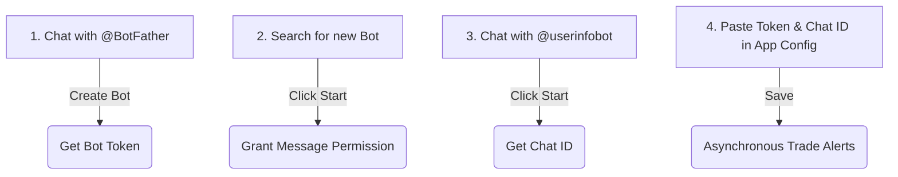

# Cloud Trader Pro - Terminal Installation Guide


Deploy Cloud Trader Pro securely on your local PC or private cloud VPS. Docker handles all dependencies automatically.

---

## 🐧 Linux VPS (Recommended)

### Step 1: Install Docker
Run these commands on your Linux Terminal to install and setup Docker & Compose:

```bash
# Update and install prerequisite tools
sudo apt update && sudo apt upgrade -y
sudo apt install -y ca-certificates curl bzip2 tar git

# Add Docker's official GPG key
sudo install -m 0755 -d /etc/apt/keyrings
sudo curl -fsSL https://download.docker.com/linux/ubuntu/gpg -o /etc/apt/keyrings/docker.asc
sudo chmod a+r /etc/apt/keyrings/docker.asc

# Add Docker's official APT repository
echo \
  "deb [arch=$(dpkg --print-architecture) signed-by=/etc/apt/keyrings/docker.asc] https://download.docker.com/linux/ubuntu \
  $(. /etc/os-release && echo "$UBUNTU_CODENAME") stable" | \
  sudo tee /etc/apt/sources.list.d/docker.list > /dev/null

# Install official Docker Engine and Compose plugin
sudo apt update
sudo apt install -y docker-ce docker-ce-cli containerd.io docker-buildx-plugin docker-compose-plugin

# Enable and start Docker
sudo systemctl enable --now docker
```

### Step 2: Run the Script Installer
Download deployment templates, Docker Compose files, and scripts automatically:

```bash
curl -sSL https://raw.githubusercontent.com/bibhutibbb/cloud-trader-pro-build/main/install.sh | sudo bash
```

---

## 🪟 Windows PC

### Step 1: Install Docker Desktop
Docker handles execution encapsulation. It isolates credentials locally for complete system security.
1. Download and install [Docker Desktop for Windows](https://www.docker.com/products/docker-desktop/).
2. Ensure the **WSL 2 backend** component is checked during installation setup.
3. Restart your computer when prompted.

### Step 2: Run PowerShell Installer
Launch PowerShell as **Administrator** and paste the following setup script:

```powershell
Set-ExecutionPolicy Bypass -Scope Process -Force; [System.Net.ServicePointManager]::SecurityProtocol = [System.Net.SecurityProtocolType]::Tls12; iex ((New-Object System.Net.WebClient).DownloadString('https://raw.githubusercontent.com/bibhutibbb/cloud-trader-pro-build/main/install.ps1'))
```

---

## ⚙️ Step 3: Configure App Settings (Optional / Automated)

> **Installer Script Note:**
> If you ran the single-line installer script, a secure random `dashboard_password` and `jwt_secret` were automatically generated and pre-configured inside `configs/app_settings.json` for you! You can skip this step, start the server, and log in to the web console at [terminal.cloudtraderpro.in](https://terminal.cloudtraderpro.in) to configure your license and credentials directly in the Web UI.

If you are setting up manually: Navigate to your installation folder (default is `/opt/cloudtraderpro` on Linux, or `C:\CloudTraderPro` on Windows), open the `configs/` subfolder, duplicate/rename the file `app_settings.json.sample` to `app_settings.json`, and update your settings:

```json
{
    "dashboard_password": "your_secure_web_password",
    "active_broker": "flattrade",
    "jwt_secret": "long_random_string_for_web_tokens",
    "session_timeout_minutes": 1440,
    "server_port": 8002,
    "license_key": "your_license_key_here",
    "data_gatekeeper_url": "https://ctp-hist-data.cloudtraderpro.in",
    "serve_static_files": false,
    "allowed_origins": "https://terminal.cloudtraderpro.in"
}
```

> **Security Advice:** Avoid leaving default password settings. Your trading console handles automated trades—make sure your passwords and secrets are unique.

#### 💡 How to generate a secure JWT Secret:
To generate a cryptographically secure 32-byte hex key, run one of the following commands in your terminal and paste the generated string into the `jwt_secret` field:

* **Linux / macOS / Git Bash:**
  ```bash
  openssl rand -hex 32
  ```

* **Windows (PowerShell / CMD):**
  ```cmd
  python -c "import secrets; print(secrets.token_hex(32))"
  ```

---

## 🚀 Step 4: Launch Docker Container

Open your terminal or command prompt, change directory to your installation folder, and spin up the services:

### Linux VPS:
```bash
cd /opt/cloudtraderpro
sudo docker compose up -d
```

### Windows PC:
```cmd
cd C:\CloudTraderPro
docker compose up -d
```

---

## 🖥️ Step 5: Launch Web Terminal

The Cloud Trader Pro terminal interface is hosted centrally. You do not host the frontend dashboard files locally or on your own VPS. Access your trading dashboard exclusively at:

👉 **[terminal.cloudtraderpro.in](https://terminal.cloudtraderpro.in)**

### To connect to your private backend:
1. Open the central terminal link above.
2. On the login page, enter your local or remote **API Server URL**:
   - For local computer setups: `http://localhost:8002`
   - For VPS setups: your configured secure tunnel domain (e.g., `https://trader.yourdomain.com`)
   - 💡 *Don't own a custom domain? You can contact support to request a free subdomain (e.g., `user1.cloudtraderpro.in`) mapped to your tunnel.*
3. Provide the `dashboard_password` you configured in `app_settings.json`.
4. If this is your first startup, paste your activation license key inside the console settings to unlock the trading engine.

---

## 🌐 Step 6: Networking & Cloudflare Tunnel Configuration

The application requires a secure HTTPS connection for both UI access and Broker Authentication callbacks. A Cloudflare Tunnel is the safest way to expose the application to the internet without opening firewall ports.

### Step 1: Create a Tunnel in Cloudflare Zero Trust
1. Log into your [Cloudflare Zero Trust Dashboard](https://dash.cloudflare.com/).
2. Navigate to **Access → Tunnels** → Click **Create a Tunnel**.
3. Select **Cloudflare** as your connector type, name the tunnel, and save it.
4. Under "Install and run a connector", choose **Docker** and copy the command provided (or copy just the raw `--token` value).

### Step 2: Configure the Tunnel Sidecar (Automatic Setup)
To configure the tunnel companion container automatically:
1. Open `cloudflare_tunnel_command.txt` in a text editor. On Ubuntu Linux, you can open and edit it using **nano**:
   ```bash
   cd /opt/cloudtraderpro
   sudo nano cloudflare_tunnel_command.txt
   ```
2. Paste the entire `docker run` command copied from Cloudflare (or paste the raw token string).
3. Run the automated script:
   - **Ubuntu / Linux:**
     ```bash
     chmod +x setup.sh
     sudo ./setup.sh
     ```
   - **Windows (PowerShell):**
     ```cmd
     setup.bat
     ```

The setup script will automatically extract the token, update your `.env` configuration, create a `docker-compose.override.yml` sidecar container, and boot up both the trader backend and the tunnel!

### Step 3: Route Your Domain
In the Cloudflare Tunnel dashboard, go to the **Public Hostname** tab, click **Add a public hostname**, and configure the fields:
- **Subdomain:** `trader` (or any subdomain of your choice, e.g. `trader.yourdomain.com`).
- **Domain:** Select your registered domain.
- **Type:** `HTTP`
- **URL:** `backend-api:8002` (routing requests internally inside the Docker network to the backend API container).
  - 💡 *Running `cloudflared` directly on your host system? Set the URL to `localhost:8002` instead.*

### Step 4: Broker-Side Handshake
Log into the Developer Portal for your Active Broker (Flattrade, Upstox, or Shoonya), select your App, locate the Redirect URL field, and configure the redirect endpoint:

```
https://terminal.cloudtraderpro.in/api/auth/callback
```

Since the web terminal frontend is centrally hosted, this callback URL is universal and works for all setups (both local computer and remote cloud VPS). The broker will securely redirect back to the terminal, which then forwards the authentication token directly to your private API server.

> **⚠️ Critical:** Ensure there are no trailing slashes, spaces, or query parameters. The URL must match the broker's registration field exactly.

---

### Request a Subdomain from the Developer/Admin (Easiest)
If you do not own a custom domain name, you can contact the system administrator or developer to request a subdomain allocation (e.g., `yourname.cloudtraderpro.in`).

#### 1. Admin/Developer Setup:
- Admin creates a new tunnel on their Cloudflare account for your VPS.
- Admin maps the subdomain (e.g., `yourname.cloudtraderpro.in`) in Cloudflare to route to target HTTP URL `backend-api:8002`.
- Admin sends you the unique **Tunnel Token** generated by Cloudflare.

#### 2. User Setup:
- Save the token inside the file `cloudflare_tunnel_command.txt` in your deployment directory.
- Run the setup helper script:
  - Linux / VPS: `sudo ./setup.sh`
  - Windows: Double-click `setup.bat` (or run `.\setup.ps1`)
- The script will automatically save the token to your `.env` file, generate `docker-compose.override.yml`, and launch both the trader backend and the Cloudflare tunnel sidecar client.

---

## 🔔 Configuring Notification Webhooks (Telegram & Discord)

Cloud Trader Pro features an asynchronous notification dispatcher. When a trade is executed, positions are closed, or cooling-down safeguards are triggered, the system instantly delivers rich notifications to your personal devices without adding latency to low-latency trading loops.

### 1. Telegram Bot Alerts

Telegram notifications do not require you to provide your phone number. Instead, they use a **Bot Token** (the sender identity) and your personal **Chat ID** (the destination address).


```mermaid
graph TD
    A[1. Chat with @BotFather] -->|Create Bot| B(Get Bot Token)
    C[2. Search for new Bot] -->|Click Start| D(Grant Message Permission)
    E[3. Chat with @userinfobot] -->|Click Start| F(Get Chat ID)
    G[4. Paste Token & Chat ID in App Config] -->|Save| H(Asynchronous Trade Alerts)
```

#### Step-by-Step Telegram Setup:
1. **Create the Telegram Bot (The Sender):**
   * Search for `@BotFather` in the Telegram search bar (it is the official system bot to create other bots) and press **Start**.
   * Send the command `/newbot`.
   * Follow the prompt to give your bot a name (e.g. `My Cloud Trader Alerts`) and a unique username ending in "bot" (e.g. `MyCloudTraderAlertBot`).
   * `@BotFather` will reply with a long **HTTP API Token** (e.g., `123456789:ABCdefGhIJKlmNoPQRsTUVwxyZ`). Copy this token.
2. **Start the Bot (Crucial Anti-Spam Step):**
   * Click on the link provided by BotFather (e.g., `t.me/MyCloudTraderAlertBot`) or search for your bot's username in Telegram.
   * Click the **Start** button (or send a message). 
   * > [!IMPORTANT]
   * > If you do not click **Start**, Telegram's anti-spam security will prevent the bot from sending any messages to your account.
3. **Get Your Chat ID (The Destination Address):**
   * Search for `@userinfobot` in Telegram and press **Start**.
   * The bot will instantly reply with your account's unique `Id` (a series of numbers, e.g. `987654321`). Copy this number.
   * *(Alternative: If you want alerts sent to a Telegram Group instead of a private message, add your custom bot as a member of the group, add `@raw_data_bot` to get the group's Chat ID—which starts with a minus sign like `-100123456789`—and use that ID).*
4. **Save in Cloud Trader Pro:**
   * Go to the **Application Configuration** dashboard in your browser.
   * Toggle on the **Telegram Bot Notifications** switch.
   * Paste the **Telegram Bot Token** and **Telegram Chat ID** in the corresponding fields.
   * Click **Save Settings**.

---

### 2. Discord Webhook Alerts

Discord uses incoming webhooks to push rich embedded messages directly into a specific server channel.

#### Step-by-Step Discord Setup:
1. **Create an Incoming Webhook:**
   * Open your Discord application and navigate to your server.
   * Right-click the channel where you want trading alerts to appear and select **Edit Channel**.
   * Go to **Integrations** -> **Webhooks** -> Click **Create Webhook** or **New Webhook**.
   * Name the webhook (e.g., `Cloud Trader Pro Alerts`) and copy the **Webhook URL**.
2. **Save in Cloud Trader Pro:**
   * Open the **Application Configuration** dashboard.
   * Toggle on the **Discord Webhook Notifications** switch.
   * Paste the copied **Webhook URL** in the field.
   * Click **Save Settings**.

---

## 🛠️ Need Remote Setup Support?

If you run into issues configuring your VPS, static IP, or docker engine, our engineers can assist you directly using secure screen sharing.

- 🖥️ [Download RustDesk (Windows)](https://github.com/rustdesk/rustdesk/releases/download/1.4.9/rustdesk-1.4.9-x86_64.exe)
- 💬 [Message Support WhatsApp](https://wa.me/917001041694)

---

## 📞 Support & Contact
For setup assistance, questions, or requesting a custom subdomain, contact:
*   **Official Website:** [cloudtraderpro.in](https://cloudtraderpro.in)
*   **WhatsApp Support:** [Chat on WhatsApp (+91 7001041694)](https://wa.me/917001041694)
*   **WhatsApp Channel:** [Join our WhatsApp Channel](https://whatsapp.com/channel/0029Vb8LdceHFxP1LQf0530s)

---

## ⚖️ License & Disclaimer
**PROPRIETARY & CONFIDENTIAL:** This software is not open-source. Unauthorized distribution, copying, decompilation, or modification is strictly prohibited. Official Portal: [cloudtraderpro.in](https://cloudtraderpro.in)

**TRADING DISCLOSURE:** Algorithmic trading involves substantial risk of loss. The author and developers assume no liability for financial outcomes. Always trade responsibly.

---
**Developed with ❤️ by Bibhuti**
